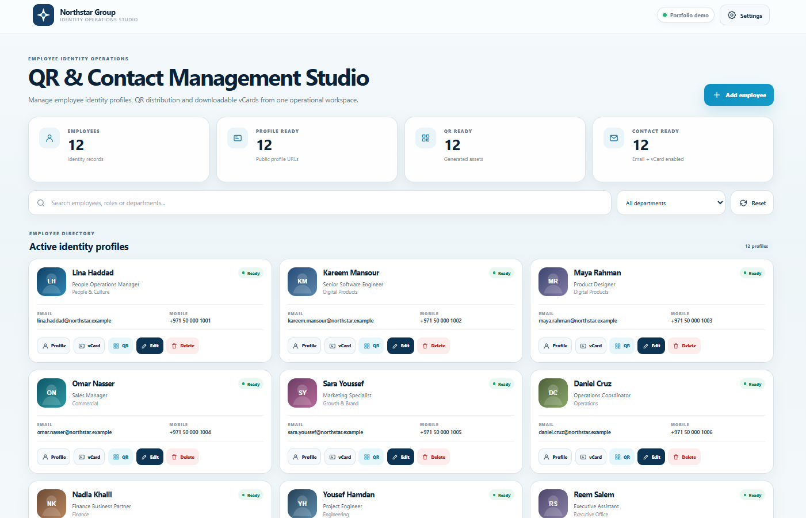
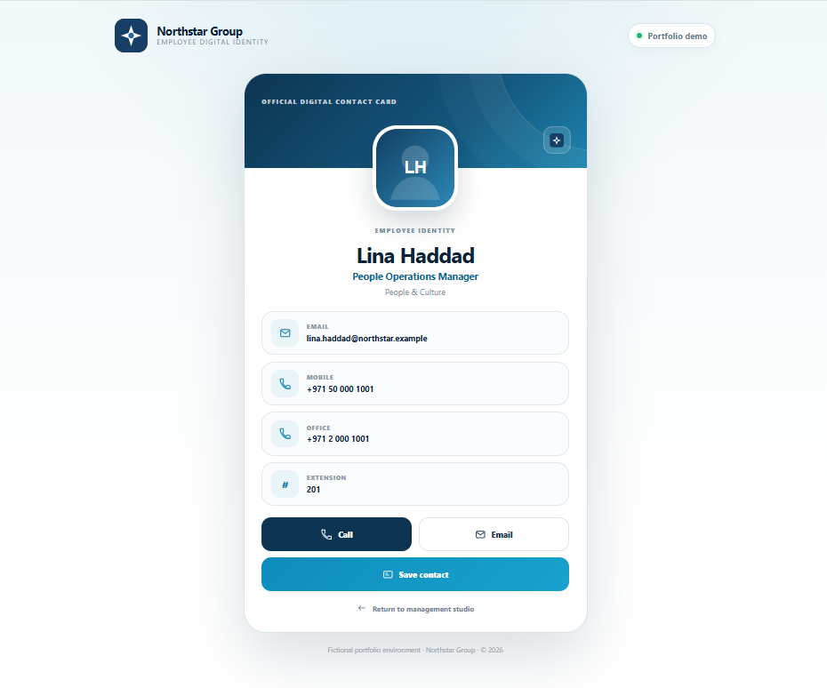

# Employee Digital Identity Operations Platform

A sanitized portfolio edition of a real employee QR and contact-management workflow.

The product combines an internal **identity operations workspace** with public **employee digital contact cards**. Administrators can organize employee records, prepare QR assets, distribute profile links, and export standards-based vCards from one place.

> All people, organizations, email addresses, phone numbers, profile images, and QR destinations in this repository are fictional demo data.

## Product preview

### Identity Operations Studio



### Employee Digital Profile



## Product surfaces

### Identity Operations Studio

- Employee directory with search and department filtering
- Identity readiness metrics
- Employee profile management actions
- QR preview and downloadable QR assets
- vCard generation and download
- Read-only public portfolio mode for destructive/admin actions

### Employee Digital Profile

- Stable QR-ready profile URL
- Direct call and email actions
- Office, mobile and extension details
- One-tap standards-based vCard download
- Responsive mobile-first digital contact card

## Demo routes

```text
/                         Identity Operations Studio
/lina-haddad              Employee digital profile
/profile/lina-haddad      Explicit profile route
/vcard/lina-haddad        Download vCard
```

## Stack

- PHP 8+
- HTML5 / CSS3 / vanilla JavaScript
- JSON-backed structured employee data
- Apache / cPanel-compatible rewrite rules
- SVG + PNG QR assets

## Local development

```bash
php -S 127.0.0.1:8080 router.php
```

Open `http://127.0.0.1:8080`.

## Security and privacy

The public repository contains no production employee records or production organization assets. Direct access to the JSON data directory is blocked; PHP reads structured records server-side.

The portfolio environment is intentionally read-only for employee creation, editing and deletion while keeping the operational UI visible for technical evaluation.

See [SECURITY.md](SECURITY.md).

## Portfolio context

The original business implementation supported a real employee contact-sharing workflow. This edition preserves the product architecture and interaction model while replacing company-specific data and identities with fictional material.

## License

Portfolio review and technical evaluation only. See [LICENSE](LICENSE).
